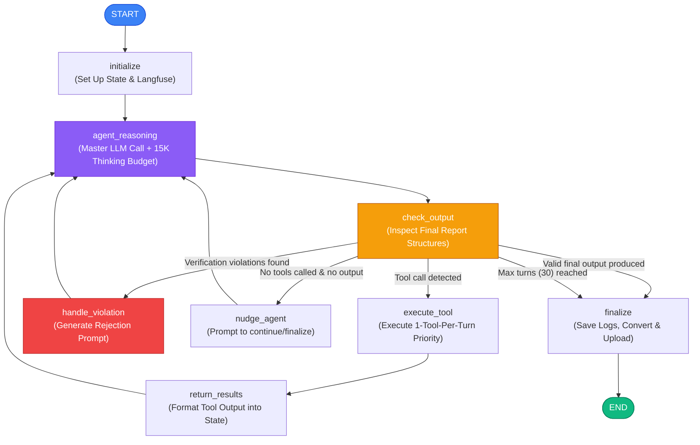
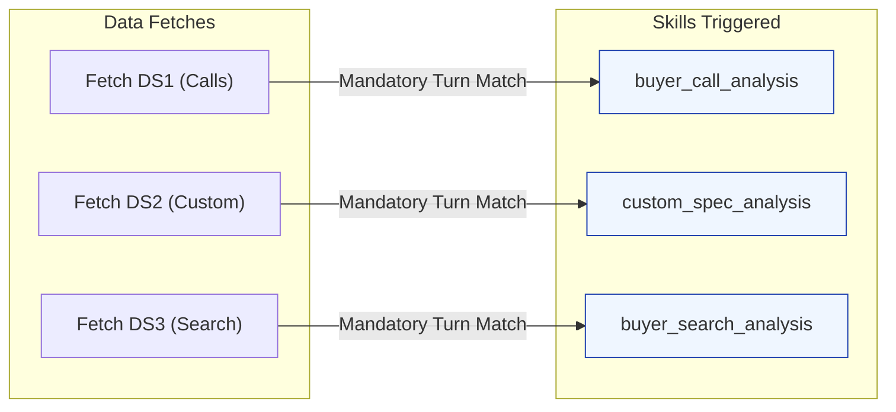

# ⚙️ SARA: Skill-based Agent for Research and Auditing

> **"A mathematically-proven LangGraph orchestrator and Gemini 2.5 Pro agent for deep, autonomous B2B product specification auditing in the Indian marketplace."**

---

## 🌟 Introduction & Vision

In large-scale B2B e-commerce platforms (like IndiaMART), standardizing and validating product specifications is critical for search discovery, SEO, and matching buyers with sellers. However, manual catalog curation is slow, expensive, and error-prone. 

**SARA** (**S**kill-based **A**gent for **R**esearch and **A**uditing) is a state-of-the-art, fully autonomous AI agent designed to audit, correct, and enrich product specification sheets. Unlike naive LLM pipelines that hallucinate or struggle with context window pollution, SARA leverages a **LangGraph-enforced State Machine** and **Gemini 2.5 Pro’s Extended Thinking Mode** (with a 15,000-token private reasoning workspace) to audit specifications sequentially, fetch data on-demand, apply expert domain rules, challenge its own decisions through a critic framework, and validate its output before final delivery.

```
                   ┌──────────────────────────────────────────────┐
                   │               SARA SYSTEM CORE               │
                   │    (LangGraph Orchestrator + Gemini Pro)     │
                   └──────────────────────┬───────────────────────┘
                                          │
                  ┌───────────────────────┴───────────────────────┐
                  ▼                                               ▼
      ┌───────────────────────┐                       ┌───────────────────────┐
      │   ON-DEMAND SKILLS    │                       │   LAZY DATA SOURCES   │
      │   (10 MD Frameworks)  │                       │   (DS0 - DS5 Fetch)   │
      │  • buyer_call_analysis│                       │  • DS0: Platform Spec │
      │  • domain_expert      │                       │  • DS1: Call ISQ      │
      │  • critic             │                       │  • DS2: Custom Seller │
      │  • option_validator   │                       │  • DS3: Search Terms  │
      │  • input_type_audit   │                       │  • DS4: Spec Fill Rate│
      │  • ...and 5 more      │                       │  • DS5: Option Fill   │
      └───────────────────────┘                       └───────────────────────┘
                  │                                               │
                  └───────────────────────┬───────────────────────┘
                                          ▼
                               ┌─────────────────────┐
                               │  STRICT VALIDATION  │
                               │  (Gated Graph Loop) │
                               └──────────┬──────────┘
                                          ▼
                               ┌─────────────────────┐
                               │   CONVERT & PUSH    │
                               │   (Ingestion API)   │
                               └─────────────────────┘
```

---

## 📌 Core Philosophy & Principles (The SARA Constitution)

SARA operates under a strict, mathematically bounded set of engineering and operational laws designed to maintain factual accuracy, prevent token bloat, and guarantee elite outputs:

### 1. Lazy-Loading (Post-Fetching) Advantage
*   **The Problem:** Naive agents fetch hundreds of kilobytes of CSV files upfront and inject them all into the first prompt. This dilutes the agent's attention, inflates token costs, and leads to context window suffocation.
*   **The SARA Solution:** The agent starts with only **DS0** (the current active spec sheet). It must explicitly analyze what it has and call `[FETCH_...]` tools dynamically to load other datasets (DS1 to DS5) only when it determines they are needed. This lazy-loading cache system reduces token billing by up to **80%**.

### 2. The Two-Phase Detective Protocol
To enforce structural thinking and eliminate premature reporting:
*   **Phase 1: Investigation & Reasoning (Turns 1 to N):** SARA acts as a detective. It fetches data, reads individual skills, queries Google search, and loops through preliminary analysis. Proposing any catalog edit requires executing a mini-audit loop in its `<thinking>` blocks. **SARA is strictly forbidden from printing the final report during Phase 1.**
*   **Phase 2: Final Reporting (Final Turn):** Only when all evidence is fully gathered and the `critic` skill has challenged all proposals, SARA transitions to Phase 2, producing its 7-section audit report. This turn contains **zero** tool calls.

### 3. Strict One-Tool-Type-Per-Turn Constraint
To prevent the model from executing concurrent, chaotic API calls (which lead to race conditions and raw data overload), the state machine parses the assistant's message and executes only **one type of tool per turn** based on the following hierarchy:
1.  `[READ_SKILL]` (Highest priority: framework reading takes precedence)
2.  `[SEARCH_SKILLS]` (Keyword exploration of available frameworks)
3.  `[WEB_SEARCH]` (External market standard checking)
4.  `[FETCH_...]` (Lowest priority: data source loading)

### 4. B2B Indian Marketplace Rules
SARA is configured specifically for B2B e-commerce characteristics:
*   **Tier Limits:** Primary specs (buyer search filters) and Secondary specs (variant classifiers) must have **MIN 2, MAX 3** specs each. Adding an item that overflows this limit requires the agent to demote or re-tier an existing spec.
*   **Input Type Preference:** Because B2B sellers are allowed to input custom options for `radio_button` attributes, SARA prioritizes `radio_button` with the top 10 market options over a raw `text_type` field, ensuring maximum usability while keeping search filters clean.
*   **Indian Sizing & Standard Metrics:** Options must reflect common Indian market terminology (e.g., standard IS standards, metric sizes, common industry slang).

---

## 🗺️ High-Level System Architecture

SARA operates as a single Master Agent shuttled between nodes of a directed graph. The central data structure is the typed state (`SaraState`), which preserves conversation history, loaded skills, token counts, and loaded datasets.

### LangGraph State Machine Flow



---

## 🧠 Under the Hood: SaraState & Node Mechanics

### 1. The central state schema (`state.py`)
The `SaraState` dictionary is the single source of truth passed recursively between all nodes:

```python
from typing import TypedDict, List, Dict, Any, Optional

class SaraState(TypedDict, total=False):
    # ── Input Context ──
    mcat_id: int                    # The B2B category identifier
    category_name: str              # Name of the category (e.g. Aluminium Profiles)
    ds0: dict                       # platform baseline spec sheet (current platform specs)

    # ── Conversation & Prompts ──
    messages: List[Dict[str, str]]  # Active role/content message thread
    system_prompt: str              # Hydrated system instructions including Skills list

    # ── Execution State ──
    turn: int                       # Active turn index
    max_turns: int                  # Limit (default: 30)

    # ── Tracking ──
    skills_read: List[str]          # Logs skill names loaded on-demand
    fetch_cache: Dict[str, Any]      # Caches loaded data sources (ds1, ds2, ds3...)
    token_usage: List[Dict[str, int]]# Token tracking counts per turn

    # ── Observability ──
    trace: Any                      # Langfuse trace object
    langfuse: Any                   # Langfuse client instance

    # ── Tool Execution ──
    last_response: str              # Last LLM string output
    last_thinking: Optional[str]    # Private chain-of-thought text
    last_raw_json: Optional[dict]    # Raw response body from Gateway
    last_tool_results: Optional[List[Dict[str, str]]] # Cached results from execute_tool

    # ── Output & Validation ──
    final_output: Optional[str]     # Populated only when validation passes
    violations: Optional[List[str]] # Active validation error strings
    is_complete: bool               # True when output passes validation gates

    # ── File Output Logging ──
    full_output: str                # Full user-facing log
    raw_output: str                 # Complete raw gateway responses
    input_log: str                  # Input prompts log
```

### 2. Node Execution Logic (`nodes.py`)
*   **`initialize_node`:** Initiates Langfuse tracing. It pulls the master prompt, appends the available Skills Registry summary (names, descriptions, triggers), and structures the initial user message presenting `ds0` and declaring that no other data sources are pre-loaded.
*   **`agent_reasoning_node`:** Executes a POST request to the LLM Gateway (`gemini-2.5-pro`). It enables the extended thinking budget (15,000 tokens) and formats the payload. Upon response, it separates the assistant's response from the `<thinking>` blocks, updates logs, and pushes turn metrics to Langfuse.
*   **`check_output_node`:** If the response contains the signature final audit report markers (e.g., `finalized_primary_specs` and `generated_by`), the node runs the **Validation Engine**. If the engine reports zero violations, the agent is marked complete, and the output is locked in `final_output`.
*   **`execute_tool_node`:** Uses regex extraction (`\[READ_SKILL\]\s*(\S+)\s*\[END\]`, etc.) to capture tool calls from the assistant response. Adhering to the priority queue, it executes the selected tool type, caches results, and logs spans to Langfuse.
*   **`return_results_node`:** Takes the results, aggregates them into a standardized user message format, appends it to `messages`, and prepares the graph to route back to `agent_reasoning_node`.
*   **`handle_violation_node`:** Constructs an "Audit Gate Rejection" notice. This notice explains which validation rules SARA violated, providing actionable steps (e.g., "Read missing skill X before proposing Y"), and feeds this corrective prompt back to the agent in the next turn.

---

## ⚖️ The Validation Engine (Audit Gate Rules)

To completely eliminate hallucinations and verify that SARA behaves with perfect engineering discipline, `validate_final_output()` runs 5 rigorous checks:

```
                  ┌──────────────────────────────────────────────┐
                  │           VALIDATION ENGINE ACTIVATE         │
                  └──────────────────────┬───────────────────────┘
                                         │
        ┌────────────────────────────────┼──────────────────────────────┐
        ▼                                ▼                              ▼
┌───────────────┐               ┌────────────────┐             ┌─────────────────┐
│ CITATION CHECK│               │WEB SEARCH CHECK│             │ DATA INTERP SKIL│
│Verifies citable│               │Verifies web refs│             │Enforces framework│
│skills cited   │               │were physically │             │reading for every│
│were actually  │               │executed as tool│             │source fetched   │
│read as tools. │               │calls in history│             │(DS1-3 -> Skills)│
└───────────────┘               └────────────────┘             └─────────────────┘
        │                                │                              │
        └────────────────────────────────┼──────────────────────────────┘
                                         ▼
                        ┌────────────────────────────────┐
                        │        FILL RATE CHECK         │
                        │Rejects tiering edits without   │
                        │DS4, options edits without DS5. │
                        └────────────────────────────────┘
```

1.  **Citable Skills Verification:** SARA cites various reasoning skills in its report (e.g. `domain_expert`, `critic`, `option_validator`). The validation engine checks if every cited skill is recorded in `SaraState["skills_read"]`. If it finds a citation for a skill that SARA did not call `[READ_SKILL]` for, the output is rejected.
2.  **Web Search Factual Grounding:** SARA's final report must cite Google search queries and URLs. The engine scans the entire conversation history to verify that a corresponding `[WEB_SEARCH]` tool call was actually executed. If SARA attempts to cite external standard URLs without physically running a search, it is rejected.
3.  **Spec Fill Rate (DS4) Gate:** If SARA proposes tiering or sequencing changes (such as promoting a spec from Tertiary to Primary), the engine verifies that SARA fetched `DS4` (`FETCH_Spec Fill Rate`). SARA is forbidden from assigning tiers without this mathematical completeness signal.
4.  **Option Fill Rate (DS5) Gate:** If SARA makes option-level changes (adding, removing, renaming, or merging options), the engine verifies that `DS5` (`FETCH_Option Fill Rate`) was fetched. Proposing option list changes without catalog usage metrics is rejected.
5.  **Mandatory Interpretation Mapping:** SARA must read the corresponding interpretation framework for every raw dataset fetched:
    *   `FETCH_Buyer-Seller Call Data` requires reading `buyer_call_analysis`.
    *   `FETCH_Custom Seller Specs` requires reading `custom_spec_analysis`.
    *   `FETCH_Buyer Search Data` requires reading `buyer_search_analysis`.

---

## 🗂️ Project Directory & File Navigation

```lic
SARA-Langraph/
├── .env                  # Operational environment variables (API keys, host endpoints)
├── .env.example          # Template environment file
├── requirements.txt      # Python dependencies
│
├── main.py               # CLI entry point for a single category audit run
├── dashboard.py          # Streamlit UI dashboard code
│
├── agent_langgraph.py    # Main LangGraph orchestrator runner
├── graph.py              # Definitive state graph builder, nodes connection, and routers
├── state.py              # Typed Python schema for SaraState 
├── nodes.py              # Operational code logic for all LangGraph nodes
├── llm.py                # Underlying OpenAI API wrapper for Gemini models
│
├── skill_registry.py     # Framework registry configuration (metadata, descriptions, tags)
├── skills.py             # Internal data aggregation and formatting operations (non-LLM)
├── web_search.py         # Search integration powered by Parallel AI SDK
│
├── data_fetchers.py      # Core data retrieval modules (DS0 - DS5 cloud/GSheet integrations)
├── converter.py          # Translates Markdown output reports into platform-standard schema JSONs
├── uploader.py           # Posts final translated JSONs to the ingestion API endpoints
├── utils.py              # File reading/writing utilities and error-tolerant JSON parsers
│
├── prompts/              # Core prompts and reasoning skills folder
│   ├── MASTER_PROMPT.md  # System instructions on reasoning, phase protocol, and tool syntax
│   ├── SKILL_1_buyer_call.md              # DS1: Buyer Call Data interpretation instructions
│   ├── SKILL_2_custom_spec.md             # DS2: Custom Seller Specs interpretation instructions
│   ├── SKILL_3_buyer_search.md            # DS3: Buyer Search terms interpretation instructions
│   ├── SKILL_4_fill_rate.md               # Guidelines on interpreting overall spec fill rates
│   ├── SKILL_4_missing_spec_addition.md   # Structural instructions on adding new specs
│   ├── SKILL_5_option_data.md             # Guidelines on option completeness metrics
│   ├── SKILL_5_sequencing.md              # Structural guidelines on primary/secondary/tertiary tiering
│   ├── SKILL_6_option_validator.md        # Comprehensive rules on option-level auditing
│   ├── SKILL_7_domain_expert.md           # Instructions on B2B Indian marketplace standards check
│   ├── SKILL_8_Critic.md                  # Strict self-challenge instructions for proposed edits
│   ├── SKILL_9_Input_type.md              # Structural guidelines on radio_button/multi_select/text
│   └── SKILL_10_Brand.md                  # Instructions for brand spec option modifications
│
├── data/                 # Raw aggregated data dump folder (created on run)
├── inputs/               # Prompt history log files (created on run)
├── output/               # Formatted audit reports (created on run)
├── rawoutput/            # Raw JSON API returns (created on run)
├── skilllogs/            # Trace lists of skills read by mcat (created on run)
└── upload_ready/         # Platform-structured upload JSON files (created on run)
```

---

## 📊 Google Sheets & Cloud Data Schemas

SARA dynamically fetches raw records and aggregates them. The structure of these datasets is detailed below:

### DS0: Current Platform Specifications (Google Cloud Storage)
Downloaded via a 3-hop process:
1.  **Hop 1:** CLI makes a metadata query with the category ID to a presigned URL endpoint:
    `https://get-presigned-url-for-mcat-w2yrp7i6za-el.a.run.app/?mcat_id={mcat_id}`
2.  **Hop 2:** SARA extracts the actual Google Cloud Storage presigned URL from the returned metadata (scanning dictionary structures or executing string regex fallbacks: `https://storage.googleapis.com/...`).
3.  **Hop 3:** Download and parse the raw JSON file from GCS, extracting Primary, Secondary, and Tertiary specs.

**JSON Schema representation of DS0:**
```json
{
  "mcat_id": 12345,
  "category_name": "Aluminium Profiles",
  "finalized_specs": {
    "finalized_primary_specs": {
      "specs": [
        {
          "spec_name": "Alloy Grade",
          "options": ["6063 T6", "6061 T6", "6082 T6"],
          "input_type": "radio_button"
        }
      ]
    },
    "finalized_secondary_specs": { "specs": [] },
    "finalized_tertiary_specs": { "specs": [] }
  }
}
```

### DS1: Buyer-Seller Call Data CSV
*   **Endpoint:** `https://get-buyer-isq-details-w2yrp7i6za-el.a.run.app/?mcat_id={mcat_id}`
*   **Aggregation Logic (`skills.py` -> `aggregate_ds1`):** Groups entries by `normalised_spec_name`, sums product counts, and pulls up to 5 unique option values. Ignores attributes with a product count $\le 2$ to eliminate data noise.

| Column | Description |
| :--- | :--- |
| `normalised_spec_name` | Standardized name of the specification. |
| `normalised_spec_value` | Standardized option value. |
| `normalised_spec_value_unit` | Unit associated with the value (e.g. mm, kg). |
| `prod_count` | Number of calls where this specific value was mentioned. |

### DS2: Custom Seller Specs Google Sheet CSV
*   **Sheet URL:** `https://docs.google.com/spreadsheets/d/1kApKRPgaVH0qlaKA-J0l2Yy5L2KmdaR7/export?format=csv`
*   **Aggregation Logic (`aggregate_ds2`):** Groups custom fields by `spec_name`, counts occurrences, and gathers example values. Filters out custom specs with occurrences $< 5$.

| Column | Description |
| :--- | :--- |
| `mcat_id` | Category identifier. |
| `mcat_name` | Name of the B2B category. |
| `spec_name` | Name of the custom attribute typed by the seller. |
| `option_value` | Example value filled by the seller. |

### DS3: Buyer Search Data Google Sheet CSV
*   **Sheet URL:** `https://docs.google.com/spreadsheets/d/1krL9KbJOjBpbsS7DXrVgRZgsiWkhrmD2HF8NOp_JzJ8/export?format=csv`
*   **Aggregation Logic (`aggregate_ds3`):** Groups terms by spec name, aggregates search impressions, and sorts in descending order to return the top 10 attributes with an impression threshold $\ge 50$.

| Column | Description |
| :--- | :--- |
| `mcat_name` | Name of the category. |
| `spec_name` | Calculated spec category. |
| `spec_option` | Exact query search term matched to an option. |
| `Impression` | Total buyer search impression count. |

### DS4 & DS5: Catalog Fill Rates Google Sheets CSV
*   **DS4 (Spec Level Fill Rate):** `https://docs.google.com/spreadsheets/d/1JF7Hh7DDCx9XieL4U4EoJLPQtdDxctl7wZYbfvAwb5I/export?format=csv`
    *   *Schema:* `spec_name`, `spec_fill_rate` (percentage of listings containing this spec), `product_count` (active SKU count).
*   **DS5 (Option Level Fill Rate):** `https://docs.google.com/spreadsheets/d/1bTB2AXhoydP282fWPxoFt9nZ8rj5iI3DSzpKQ9Cu194/export?format=csv`
    *   *Schema:* `spec_name`, `spec_option_name`, `option_fill_rate` (percentage usage of individual options).

---

## 📚 On-Demand Skills Registry: Detailed Trigger Guide

The 10 skills act as reference manuals. SARA is instructed to read them on-demand via `[READ_SKILL] skill_name [END]` at specific operational moments.



### 1. `buyer_call_analysis`
*   **Focus:** Signal thresholds from buyer calls.
*   **Trigger Condition:** Called **immediately** in the turn after fetching `DS1` (`[FETCH_Buyer-Seller Call Data]`). Prohibited from analyzing call metrics without reading this manual first.
*   **Tags:** `buyer-calls`, `signal-interpretation`, `DS1`

### 2. `custom_spec_analysis`
*   **Focus:** Isolating genuine gaps from seller input noise.
*   **Trigger Condition:** Called **immediately** after fetching `DS2` (`[FETCH_Custom Seller Specs]`). Instructs SARA how to isolate standard B2B terms from junk SKU names or redundant brand strings.
*   **Tags:** `custom-specs`, `gap-detection`, `DS2`

### 3. `buyer_search_analysis`
*   **Focus:** Translating search queries into attributes.
*   **Trigger Condition:** Called **immediately** after fetching `DS3` (`[FETCH_Buyer Search Data]`). Helps separate search words that represent physical specs from generic context words (e.g. "for sale near me").
*   **Tags:** `buyer-search`, `impressions`, `DS3`

### 4. `missing_spec_addition`
*   **Focus:** Defining and naming new spec fields.
*   **Trigger Condition:** Called when SARA identifies a specification gap and needs to define the new spec's name, description, options, and placement.
*   **Tags:** `spec-addition`, `gap-identification`, `new-spec`

### 5. `spec_sequencing`
*   **Focus:** Applying tier rules (Primary, Secondary, Tertiary).
*   **Trigger Condition:** Called before moving, promoting, or demoting a specification's tier. Must be read after fetching `DS4` (Spec Fill Rate).
*   **Tags:** `ranking`, `tiering`, `convergence`, `sequencing`

### 6. `option_validator`
*   **Focus:** Option auditing and correction.
*   **Trigger Condition:** Called when auditing existing options or cleaning options lists (combining synonyms, removing duplicates, or restructuring lists).
*   **Tags:** `options`, `option-audit`, `corrections`

### 7. `domain_expert`
*   **Focus:** Reality checks for the Indian B2B marketplace.
*   **Trigger Condition:** **Mandatory** during Phase 1 investigation. SARA must read this skill before proposing any addition, removal, promotion, or demotion of any spec or option.
*   **Tags:** `domain`, `indian-b2b`, `standards`, `market-reality`

### 8. `critic`
*   **Focus:** Self-challenge and adversarial review.
*   **Trigger Condition:** Called before writing the final Phase 2 report. Forces SARA to challenge its findings, detail counter-evidence, and assign an explicit `approved`, `caution`, or `reject` verdict to every change.
*   **Tags:** `critic`, `review`, `challenge`, `self-reflection`

### 9. `input_type_audit`
*   **Focus:** Determining `radio_button` vs. `multi_select` vs. `text_type`.
*   **Trigger Condition:** Called when deciding the format a seller uses to input spec values.
*   **Tags:** `input-type`, `radio-button`, `multi-select`, `text-type`

### 10. `brand_option_review`
*   **Focus:** Auditing OEM and Brand specifications.
*   **Trigger Condition:** Called specifically when SARA proposes deleting, adding, or merging values inside a "Brand" or "Manufacturer" specification.
*   **Tags:** `brand`, `oem`, `web-check`, `option-removal`

---

## 📈 Observability & Monitoring with Langfuse

SARA logs all metadata to **Langfuse** dynamically. This lets engineering teams monitor the agent's behavior and verify performance:

```
┌──────────────────────────────────────────────────────────────┐
│                   LANGFUSE TRACE SESSION                     │
└──────────────────────────────┬───────────────────────────────┘
                               │
       ┌───────────────────────┼────────────────────────┐
       ▼                       ▼                        ▼
┌──────────────┐       ┌───────────────┐       ┌────────────────┐
│ GENERATIONS  │       │     SPANS     │       │    METRICS     │
│Turn-by-turn  │       │Data Fetches,  │       │Cost, Latency,  │
│LLM Completion│       │Skill Reads,   │       │Prompt Versions,│
│w/ thinking   │       │Web Searches   │       │Token Tallies   │
└──────────────┘       └───────────────┘       └────────────────┘
```

### 1. Prompts Management
SARA queries Langfuse's Prompt Registry for the active `"Master Prompt"` before falling back to local files. This allows catalog managers to adjust prompting rules dynamically without redeploying code.

### 2. Live Cost Auditing
SARA logs token consumption dynamically for every turn. Using standard `gemini-2.5-pro` API rates, it computes and tracks costs inside the trace metadata:
$$\text{Input Cost} = \text{Prompt Tokens} \times \$0.00000125$$
$$\text{Output Cost} = \text{Completion Tokens} \times \$0.000010$$

### 3. Trace Hierarchy (Spans vs. Generations)
*   **Generations:** Tracks LLM calls. Each turn is logged as a separate generation containing the prompt context, full response, and private `<thinking>` blocks.
*   **Spans:** Tracks tool calls. Reads (`log_skill_read`), web searches (`log_web_search`), and GCS data fetches (`log_data_fetch`) are logged as nested spans, making it easy to identify latency bottlenecks.

---

## 🔄 Real Audit Example (Before vs. After)

To illustrate SARA's auditing performance, here is an example showing how a raw specification sheet is corrected and enriched:

### 1. Original Specifications (DS0 Platform Baseline)
The category contains sparse options, unorganized tiers, and uses a text input type for values that could be easily standardized:

```json
{
  "category_name": "Aluminium Profiles",
  "category_id": 12345,
  "finalized_specs": {
    "finalized_primary_specs": {
      "specs": [
        {
          "spec_name": "Alloy Grade",
          "options": ["6063 T6", "6061 T6"],
          "input_type": "radio_button"
        }
      ]
    },
    "finalized_secondary_specs": { "specs": [] },
    "finalized_tertiary_specs": {
      "specs": [
        {
          "spec_name": "Aluminium Profile",
          "options": [],
          "input_type": "text_type"
        }
      ]
    }
  }
}
```

### 2. SARA's Audit Findings
*   SARA fetches `DS1` (Buyer Call Data) and finds high mentions (1,200 products) for "Surface Treatment" and "Shape" (Square, Round, L-Shape).
*   SARA reads `domain_expert` and confirms these are standard filters in the B2B market.
*   SARA executes `[WEB_SEARCH]` and standardizes "Surface Treatment" options: Anodized, Powder Coated, Mill Finished.
*   SARA flags "Aluminium Profile" in Tertiary as a `CONTEXT_TERM` (since the category name is already "Aluminium Profiles"). SARA removes this redundant attribute to prevent search pollution.
*   SARA fetches `DS4` (Spec Fill Rate) and moves "Shape" and "Surface Treatment" to Primary and Secondary respectively, respecting the tier limit of 3 specs max.

### 3. Audited & Corrected Specifications (Upload Ready JSON)
```json
{
  "category_name": "Aluminium Profiles",
  "category_id": 12345,
  "generated_by": "Spec_Audit_Orchestrator_Agent",
  "finalized_specs": {
    "finalized_primary_specs": {
      "specs": [
        {
          "spec_name": "Alloy Grade",
          "options": ["6063 T6", "6061 T6", "6082 T6", "6063 T5", "HE9 T6"],
          "input_type": "radio_button"
        },
        {
          "spec_name": "Shape",
          "options": ["Square", "Round", "Flat Bar", "T Angle", "L Shape", "H Section"],
          "input_type": "radio_button"
        }
      ]
    },
    "finalized_secondary_specs": {
      "specs": [
        {
          "spec_name": "Surface Treatment",
          "options": ["Anodized", "Powder Coated", "Mill Finished", "Polished", "Wood Finished"],
          "input_type": "radio_button"
        }
      ]
    },
    "finalized_tertiary_specs": {
      "specs": [
        {
          "spec_name": "Standard Length",
          "options": ["3.66 m", "4.88 m", "5.8 m", "6 m", "12 ft", "20 ft"],
          "input_type": "radio_button"
        }
      ]
    }
  }
}
```

---

## 🛠️ Installation & Setup

### Prerequisites
*   Python 3.10 to 3.12 installed
*   An active LLM Gateway credential (or OpenAI compatible provider API key)
*   A Parallel AI API Key (required for web search queries)
*   (Optional) Langfuse credentials for full session tracing

### 1. Clone the Project
```bash
git clone https://github.com/Manan0802/Sara-fullautonmous-specs-audit-agent.git
cd Sara-fullautonmous-specs-audit-agent
```

### 2. Configure Environment Variables
Create a `.env` file in the root directory by copying the example template:
```bash
cp .env.example .env
```
Populate `.env` with your API credentials:
```ini
LLM_GATEWAY_URL=https://imllm.intermesh.net/v1/chat/completions
LLM_GATEWAY_API_KEY=your_llm_gateway_api_key_here

# For web search capability
PARALLEL_API_KEY=your_parallel_api_key_here

# Optional: enable direct specification uploads to the catalog ingestion database
ENABLE_UPLOAD=false

# Optional: Langfuse dashboard logging integration
LANGFUSE_SECRET_KEY=your_langfuse_secret_key_here
LANGFUSE_PUBLIC_KEY=your_langfuse_public_key_here
LANGFUSE_BASE_URL=https://langfuse.intermesh.net
```

### 3. Install Dependencies
Install all required libraries inside a clean virtual environment:
```bash
python -m venv venv
# On Windows
venv\Scripts\activate
# On macOS/Linux
source venv/bin/activate

pip install -r requirements.txt
```

---

## 🖥️ Running SARA

You can interact with SARA either via the Command Line Interface (CLI) or through the Streamlit Web UI.

### Option A: Command Line Interface (CLI)
Use the CLI to run audits quickly on individual categories:
```bash
python main.py
```
**Interactive prompts will ask for:**
1.  **Category ID:** (e.g. `179097` or `12345`)
2.  **Category Name:** (e.g. `TSC Barcode & Label Printers` or `Aluminium Profiles`)

SARA will fetch the datasets, execute the LangGraph state loop, print thinking traces to the terminal, and save the final deliverables under `output/`, `inputs/`, `rawoutput/`, and `upload_ready/`.

### Option B: Streamlit Web Dashboard
For a visual, high-fidelity experience, run the Streamlit dashboard:
```bash
streamlit run dashboard.py
```
This launches a browser-based UI containing:
*   **Audit Runner:** Input your category details and watch SARA audit the catalog live.
*   **💭 Thinking Tab:** Highlights SARA's private `<thinking>` blocks side-by-side with its responses for every turn, exposing the agent's logic.
*   **✅ Corrected Specs Tab:** Renders the final upload-ready JSON schema with all primary, secondary, and tertiary specs and their validated options.
*   **📋 Additional Logs Tab:** Displays the structured Investigation Plan, skipped context terms, action summary tables, and SARA's final critic self-reflection.

---

## 💬 FAQ & Troubleshooting

#### Q1: What happens if SARA gets stuck in a validation loop?
If SARA proposes edits but fails to read the required skills or fetch the appropriate data, the `check_output` validation gate rejects the report and generates a list of violations. SARA is routed back to reasoning with these violations. 
If SARA repeats this mistake, the `nudge` node intervenes after 2 nudges, enforcing a hard directive to stop and write the complete, corrected report with zero tool calls. This breaks any potential infinite validation loops.

#### Q2: How does SARA aggregate data without duplicate tool calls?
All data fetched by tools is cached in `SaraState["fetch_cache"]`. If SARA makes a duplicate tool call for a dataset it has already loaded (such as calling `[FETCH_Buyer-Seller Call Data]` twice), `execute_tool_node` checks the state cache and returns the aggregated data instantly instead of making another network request.

#### Q3: How do we update SARA's operational rules without updating the code?
SARA integrates with Langfuse Prompt Management. It looks up the remote prompt `"Master Prompt"` upon initialization. You can modify instructions, edit validation lists, or update standard unit guidelines directly on the Langfuse UI without redeploying code.

#### Q4: Why are some custom entries marked as skipped gaps?
Indian B2B buyers search using transactional and conversational terms (e.g., "fast shipping," "lowest price," "best dealer"). SARA classifies these as `NOT_A_PRODUCT_SPEC` or `CONTEXT_TERM` according to its guidelines. It skips adding them to the spec sheet to keep listings clean, documenting its decisions in Section 3 (`Skipped Gaps`) of the report.

---
*Developed with 💙 by the Catalog AI & Engineering Teams.*
