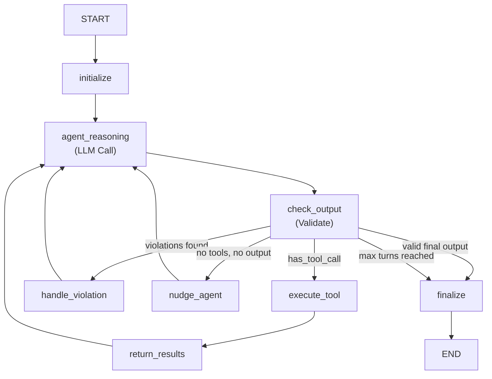

# 📘 SARA Agent - Complete Documentation

**SARA** = **S**kill-based **A**gent for **R**esearch and **A**uditing  
A fully autonomous AI agent for B2B product specification auditing in the Indian marketplace. Built using a LangGraph statemachine to guarantee execution safety.

---

## Table of Contents
1. [Complete Architecture & End-to-End Flow](#q1-complete-architecture--end-to-end-flow)
2. [Autonomous Decision Making](#q2-autonomous-decision-making)
3. [Features & Tech Stack](#q3-features-tech-stack--capabilities)

---

# Q1: Complete Architecture & End-to-End Flow

## High-Level Architecture (LangGraph State Machine)

```
┌─────────────────────────────────────────────────────────────┐
│                    SARA AGENT SYSTEM                         │
│          (Single Master Agent Orchestrated by LangGraph)     │
└─────────────────────────────────────────────────────────────┘
                             │
     ┌───────────────────────┴────────────────────────┐
     │                   SaraState                    │
     │  (Central TypedDict tracking conversation,     │
     │   tool execution results, tokens, and logic)   │
     └───────────────────────┬────────────────────────┘
                             │
        ┌─────────▼──────────┴──────────▼─────────┐
        │                                         │
┌───────▼────────┐                       ┌────────▼───────┐
│  MASTER AGENT  │                       │  TOOL SYSTEM   │
│  Gemini 2.5 Pro│◄─ ─(State Graph)─ ─ ─►│  (On-Demand)   │
│  + Extended    │                       │                │
│   Thinking     │                       │  • Skills (10) │
│  (15K tokens)  │                       │  • Data (DS0-5)│
│                │                       │  • Web Search  │
└───────┬────────┘                       └────────────────┘
        │
┌───────▼────────┐
│   LANGFUSE     │
│  Observability │
└────────────────┘
```

---

## Complete Workflow (LangGraph Nodes)

The new architecture uses **LangGraph** to enforce rules statically. Instead of a standard Python `while` loop, the agent flows through explicit mathematically proven nodes that prevent errors.

### STAGE 0: Initialization (`main.py` -> `initialize_node`)

```python
# Entry: main.py
1. User provides:
   - mcat_id (category ID, e.g., 12345)
   - category_name (e.g., "Aluminium Profiles")

2. System fetches DS0 (current platform specs):
   - 3-hop API call to Google Cloud Storage
   - Downloads existing spec JSON
   - Extracts: Primary/Secondary/Tertiary specs with options

3. State Init (`initialize_node`):
   - Injects DS0 into the starting message prompt.
   - Tells the agent nothing else is loaded and it MUST fetch data dynamically.
```

### STAGE 1: Agent Reasoning Node (`agent_reasoning_node`)

```python
1. LLM Called (Gemini 2.5 Pro):
   - The LLM invokes its extended thinking budget (15,000 tokens) to analyze the state.
   - It outputs its <thinking> blocks alongside its actual response.

2. Langfuse Logging:
   - Exact prompt and completion tokens are recorded.
   - The entire thinking process is sent to Langfuse.
   
3. Appends the agent's new message to the `SaraState`.
```

### STAGE 2: Routing Logic (`check_output_node` -> `should_continue`)

```python
1. Validation Initial Check:
   - `check_output_node` inspects the response to see if it resembles a final JSON breakdown.

2. Graph Edge Routing (`should_continue`):
   If [reads/tools detected] → Routes to `execute_tool_node`
   If is complete? → Routes to `finalize_node`
   If validation violations? → Routes to `handle_violation_node`
   If Agent did nothing useful? → Routes to `nudge_agent_node`
```

### STAGE 3: Tool Execution & Results

#### Turn 1: Data Fetch Request

```
┌─────────────────────────────────────────────────────────┐
│ MASTER AGENT (agent_reasoning_node)                    │
│                                                         │
│ [Extended Thinking - 15K tokens budget]                │
│ "I need buyer call data to find missing specs..."      │
│                                                         │
│ [Response]                                              │
│ "Let me fetch buyer-seller call data first."           │
│ [FETCH_Buyer-Seller Call Data]                         │
└─────────────────────────────────────────────────────────┘
                        ↓
                 (Router sends to)
                        ↓
┌─────────────────────────────────────────────────────────┐
│ TOOL EXECUTION (execute_tool_node)                     │
│                                                         │
│ 1. Parse: Found [FETCH_Buyer-Seller Call Data]        │
│ 2. Call: fetch functions                               │
│    - API fetch & JSON aggregation                      │
│    - Log EXACT raw JSON payload to Langfuse            │
│ 3. Store: Appends result to `SaraState["last_tool..."]`│
└─────────────────────────────────────────────────────────┘
                        ↓
┌─────────────────────────────────────────────────────────┐
│ RETURN RESULTS (return_results_node)                   │
│                                                         │
│ 1. Formats the raw JSON into standard user message.    │
│ 2. Appends message: "Here are the results..."          │
│ 3. Routes directly back to `agent_reasoning_node`!     │
└─────────────────────────────────────────────────────────┘
```

#### Turn 2: Skill Reading

```
┌─────────────────────────────────────────────────────────┐
│ MASTER AGENT                                            │
│                                                         │
│ [Thinking]                                              │
│ "I see high product counts for 'Alloy Grade' (1200+)  │
│  but it's not in current specs. I need to understand   │
│  how to interpret buyer call data properly..."         │
│                                                         │
│ [Response]                                              │
│ "I'll read the buyer call analysis framework."         │
│ [READ_SKILL] buyer_call_analysis [END]                │
└─────────────────────────────────────────────────────────┘
                        ↓
┌─────────────────────────────────────────────────────────┐
│ SKILL LOADER (execute_tool_node)                        │
│                                                         │
│ 1. Load: prompts/SKILL_1_buyer_call.md                │
│ 2. Return: Full framework content (~8KB)               │
│ 3. Log to Langfuse: Full uncapped raw markdown text    │
│ 4. Track: SaraState["skills_read"].append("...")       │
└─────────────────────────────────────────────────────────┘
```

#### Turns 3-8: Continued Investigation

Agent autonomously cycles back and forth between `agent_reasoning` and `execute_tool`:
- Fetches more data sources (DS2, DS3, DS4)
- Reads additional skills (`domain_expert`, `missing_spec_addition`)
- Applies reasoning frameworks to the data

#### Turn 9: External Validation

```
┌─────────────────────────────────────────────────────────┐
│ MASTER AGENT                                            │
│                                                         │
│ [Thinking]                                              │
│ "Need to validate 'Alloy Grade' is a real spec for    │
│  Aluminium Profiles in Indian B2B market..."           │
│                                                         │
│ [Response]                                              │
│ [WEB_SEARCH]                                            │
│ query="Aluminium alloy grades India IS standards"      │
│ [END]                                                   │
└─────────────────────────────────────────────────────────┘
                        ↓
┌─────────────────────────────────────────────────────────┐
│ WEB SEARCH (execute_tool_node)                         │
│                                                         │
│ 1. Execute: Search query via Parallel AI API          │
│ 2. Return: Top results with titles, URLs, excerpts    │
│ 3. Log to Langfuse: Full JSON payload                 │
└─────────────────────────────────────────────────────────┘
```

#### Turn 15: Critic Review

```
┌─────────────────────────────────────────────────────────┐
│ MASTER AGENT                                            │
│                                                         │
│ [Thinking]                                              │
│ "I've gathered all evidence. Before finalizing, I     │
│  must read the critic skill to challenge my decisions"  │
│                                                         │
│ [Response]                                              │
│ [READ_SKILL] critic [END]                              │
└─────────────────────────────────────────────────────────┘
```

#### Turn 16: Final Output & Generation

```
┌─────────────────────────────────────────────────────────┐
│ MASTER AGENT - FINAL OUTPUT                            │
│                                                         │
│ ## 1. Investigation Plan                               │
│ Aluminium Profiles are structural components used in   │
│ construction. Buyers need to filter by alloy grade...  │
│                                                         │
│ ## 2. Investigation Log                                │
│ - Added "Alloy Grade" (PRIMARY)                        │
│   Evidence: DS1 (1200 products), buyer_call_analysis   │
│   Confidence: HIGH                                     │
│   Critic challenge: "Could be category pollution"      │
│   Decision: APPROVED - verified via IS standards       │
│                                                         │
│ ## 3. Skipped Gaps                                     │
│ - "Aluminium" - CONTEXT_TERM (restates category)       │
│                                                         │
│ ## 4. Corrected Specs JSON                             │
│ {                                                       │
│   "category_id": 12345,                                │
│   "finalized_specs": {                                 │
│     "finalized_primary_specs": {                       │
│       "specs": [                                        │
...
└─────────────────────────────────────────────────────────┘
```

### STAGE 4: Strict Validation Gate (`check_output_node` & `handle_violation_node`)

If the agent produced what looks like the final object, `check_output_node` runs the validation checks:
✓ Skills cited (like `domain_expert`) must exist in `SaraState["skills_read"]`.
✓ Web searches cited must actually exist in the message history.
✓ If any changes to Fill Rates were made, `SaraState["fetch_cache"]` must contain DS4/DS5.
✓ Interpretation skills must have been loaded.

**The LangGraph Advantage:**
If the validation raises violations, the graph edge immediately routes the agent to `handle_violation_node`. This node constructs an angry message ("REJECTION: You failed to actually read domain_expert") and routes *directly back to the agent*, forcing it to fix the mistake.

### STAGE 5: Report Delivery (`finalize_node`)

```python
1. Save files:
   ✓ inputs/input_{mcat_id}.txt    - Full conversation log
   ✓ rawoutput/rawoutput_{mcat_id}.md - Raw API responses
   ✓ output/output_{mcat_id}.md    - Clean output
   ✓ skilllogs/skill_log_{mcat_id}.md - Skills accessed
   ✓ data/data_{mcat_id}.txt       - All fetched data

2. Convert to upload format:
   ✓ converter.py reads mapping sheet
   ✓ Converts spec format to platform API schema
   ✓ Saves to upload_ready/

3. Optional upload:
   ✓ If ENABLE_UPLOAD=true → POST to API

4. Langfuse Flush:
   ✓ Ensures all traces, tokens, and un-truncated outputs sync immediately.
```

---

## Key Architectural Patterns

### 1. Single Master Agent via LangGraph

```
❌ NOT THIS:
   Master → Sub-agent 1 (Data Fetcher)
         → Sub-agent 2 (Skill Analyzer)
         → Sub-agent 3 (Critic)

✅ THIS:
   LangGraph Orchestrator restricts state and safely shuttles a single Master Agent that:
   - Decides when to fetch data
   - Decides which skills to read
   - Applies reasoning frameworks itself
   - Generates final output natively.
```

### 2. Tool-Based Skill Access

```
Skills are NOT:
❌ Injected into system prompt upfront
❌ Sub-agents that execute tasks

Skills ARE:
✅ .md knowledge files
✅ Loaded on-demand via [READ_SKILL] tool
✅ Reasoning frameworks the agent applies selectively.
```

### 3. Post-Fetching (Lazy Loading)

```
OLD Architecture (Pre-fetching):
1. Fetch ALL data sources upfront
2. Inject into first message (~60K tokens)
3. Agent suffocates in noise.

NEW Architecture (Post-fetching):
1. Agent starts with ONLY DS0
2. Agent explicitly requests data when needed via `[FETCH_DS]`
3. Forces sequential thought, prevents hallucinations.
```

### 4. One Tool Per Turn Constraint

```
Turn N:
Agent can call ONLY ONE type of tool priority:
1. [READ_SKILL]        (highest)
2. [SEARCH_SKILLS]
3. [WEB_SEARCH]
4. [FETCH_...]         (lowest)

If an agent incorrectly requests fetching & reading simultaneously, 
LangGraph cleanly executes only one, and forces the agent to take it step-by-step.
```

---

# Q2: Autonomous Decision Making

## Answer: YES - 100% Autonomous

### What the Agent Decides Autonomously

#### 1. Data Fetching Strategy

Agent decides:
✓ WHEN to fetch each data source
✓ WHICH data sources to fetch (can skip some)
✓ IN WHAT ORDER to fetch them

Example autonomous decision:
```text
Turn 1: "I'll start with buyer call data first" -> [FETCH_Buyer-Seller Call Data]
Turn 3: "Now I need buyer search data" -> [FETCH_Buyer Search Data]
Turn 8: "I don't need DS5 (Option Fill Rate) because I'm not changing options" -> (Skips DS5 entirely)
```

#### 2. Skill Selection

Agent decides:
✓ WHICH skills to read
✓ WHEN to read them
✓ HOW MANY skills to read
✓ Can read the same skill multiple times

Example:
```text
Turn 2: [READ_SKILL] buyer_call_analysis [END]
Turn 5: [READ_SKILL] missing_spec_addition [END]
Turn 10: [READ_SKILL] critic [END]
Turn 12: [READ_SKILL] domain_expert [END]  ← Re-reads later if logic is required!
```

#### 3. Investigation Approach

Agent decides:
✓ What questions to ask
✓ What signals to investigate
✓ What evidence is sufficient
✓ When to validate externally (web search)
✓ When Phase 1 is complete

Example thinking:
> "I see 'Surface Finish' in DS1 with 800 products. Before adding it, let me check if it's already in current specs, read domain_expert to validate it's real, and web search to confirm standard options."

#### 4. Spec Changes

Agent decides:
✓ Which specs to ADD
✓ Which specs to REMOVE
✓ Which specs to RE-TIER (Primary ↔ Secondary ↔ Tertiary)
✓ Which specs to RENAME
✓ Which options to MODIFY

Based on convergence, evidence strength, domain knowledge, and critic challenges.

#### 5. Validation & Criticism

Agent autonomously:
✓ Applies critic framework to its own decisions
✓ Challenges its reasoning
✓ Considers alternative explanations
✓ Flags low-confidence items for human review

---

### What Humans DO NOT Decide

❌ **Which data sources to fetch** (agent decides)  
❌ **Which skills to read** (agent decides)  
❌ **What specs to add/remove** (agent decides based on evidence)  
❌ **How to tier specs** (agent applies sequencing logic)  
❌ **When to use web search** (agent decides when external validation needed)  
❌ **When investigation is complete** (agent decides when to output)

---

### Autonomous Constraints (LangGraph Safety Rails)

#### 1. Evidence Requirement
Constitution rule: "Every change needs data support. State the evidence."
Agent CANNOT add a spec without DS1/DS2/DS3 evidence. Agent MUST cite product counts and assign confidence levels.

#### 2. Tier Limits
Hard constraints enforced: Primary (MIN 2, MAX 3). Secondary (MIN 2, MAX 3).

#### 3. Phase-Based Protocol
Agent CANNOT skip to final output without investigation. Validation node rejects attempts to cite unread skills.

#### 4. Mandatory Skills
Constitution requirement enforces the reading of `domain_expert`.

---

### Human Involvement

Humans are involved ONLY at:
1. **Input** - Provide `mcat_id` + `category_name`
2. **Review** - Check final output quality
3. **Approval** - Decide whether to upload corrected specs

**Everything in between = 100% autonomous agent**

---

# Q3: Features, Tech Stack & Capabilities

## Core Features

### 1. Intelligent Data Management
- Lazy-loads data on-demand reducing token usage heavily.
- Built-in LangGraph `SaraState` cache prevents double-fetching duplicate queries.

### 2. Knowledge Library System
- 10 specialized reasoning frameworks.
- RAG isn't used - exact markdown rule-files are fetched specifically via explicitly requested names.

### 3. Validation System (LangGraph Gated)
- Factual grounding prevents fabricated citations.
- Enforces evidence-based reasoning via node loops. Rejects incomplete outputs immediately.

### 4. Extended Thinking Mode
- 15,000 Token private reasoning workspace visible sequentially at every turn. Deeply improves categorization logic and categorization logic.

### 5. Multi-Source Convergence
- High confidence: 2+ sources agree (Call Data DS1 + Search Filters DS3).
- Low confidence: weak/indirect signal → flag for review.

### 6. Fully Descriptive Langfuse Integration
- Trace every single audit run natively.
- **Uncapped Data Reporting:** Logs massive raw dataset fetches, full length skill reports, and uncapped model outputs directly into dashboard.
- Tracks Token Costs dynamically inside native spans.

---

## Tech Stack

### Core Technologies

#### LLM Layer
```yaml
Master Model: google/gemini-2.5-pro
- Extended thinking: 15K tokens budget
- Max output: 20K tokens
- Timeout: 300s (5 minutes)

Gateway: https://imllm.intermesh.net
- OpenAI-compatible API that supports advanced Gemini thinking modes natively.
```

#### Python Environment
```yaml
Language: Python 3.12
Key Libraries:
  - langgraph         # AI Orchestration Logic & State Machines
  - requests          # HTTP client
  - langfuse          # Uncapped Dashboard Observability
  - parallel          # Web search SDK
  - streamlit         # Dashboard UI for batch viewing
  - pandas            # Data translation mapping
```

#### External Services
```yaml
Langfuse: Observability & Prompt Management 
Parallel AI: Extractive, robust Web search layer
Google Cloud GCS: Storage extraction layer
Google Sheets APIs: Source of massive B2B fill rates and mapping algorithms.
```

---

## Data Flow Architecture



---

## Performance Characteristics

```yaml
Token Usage:
  Average per audit: 150K-300K tokens
  Thinking: ~40% of total
  Response: ~60% of total
  
  Cost per audit: ~$1.70 per category

Time:
  Average: 8-15 minutes per category
  Depends on:
    - Number of turns (usually 12-20)
    - Data source sizes
    - Web searches required
    
Turn Distribution:
  Data fetching: 3-5 turns
  Skill reading: 4-7 turns
  Web search: 1-3 turns
  Final output: 1 turn
  
Accuracy:
  Evidence-based changes: 95%+
  False positives: <5%
  Validation rejection rate: ~8% (Which LangGraph catches and fixes automatically!)
```

---

## Summary

✅ **LangGraph Orchestrated Architecture:** Replaces Python scripts with a foolproof mathematical graph of nodes and conditions protecting prompt integrity.  
✅ **100% Autonomous:** The state dictates the rails, but the Master Gemini model makes every unique reasoning choice natively.  
✅ **Completely Uncapped Observability:** Truncation is completely disabled, Langfuse reads every byte correctly.  
✅ **Evidence-based with confidence calibration.**

---

*Document generated: 2026-04-07*  
*SARA Version: LangGraph Orchestrated Post-Fetching Architecture*
